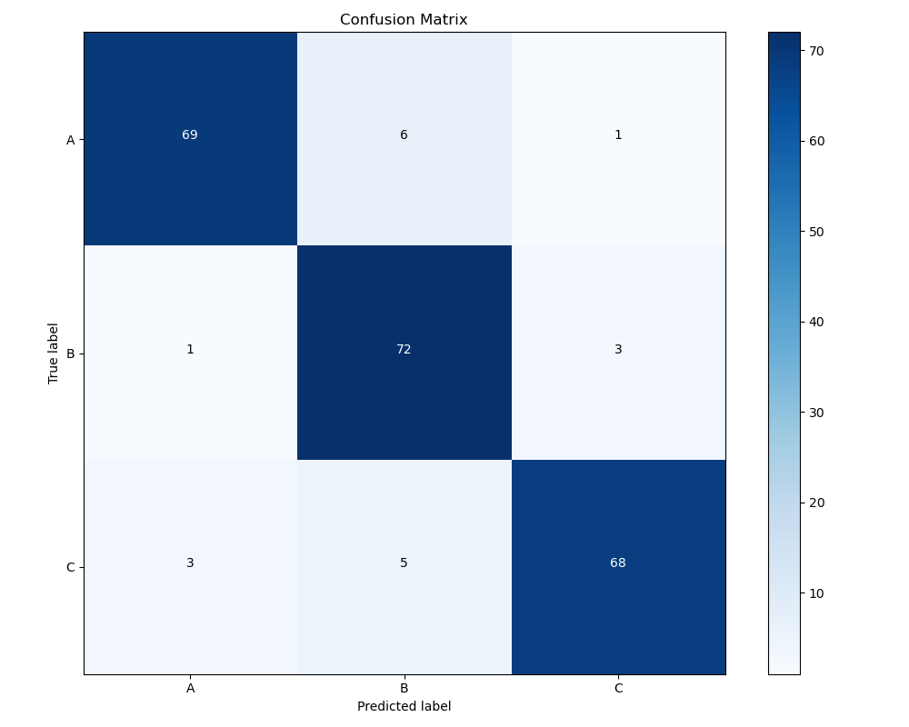

# Roof Condition Assessment with Small Dataset CNN

## Overview

This project applies deep learning to assess roof conditions from drone imagery, demonstrating how to build an effective CNN classifier using only 85 labeled images. By leveraging careful engineering and transfer learning, it tackles the real-world challenge of limited data—a common issue in specialized domains where large-scale image collection is costly or impractical.


## Technical Approach

### 1. **Image Preprocessing Pipeline**
- **Object Detection**: Integrate LandingAI's Agentic Object Detection API for automatic roof detection
- **Precise Segmentation**: Use SAM (Segment Anything Model) for pixel-level roof extraction

### 2. **Small Dataset CNN Strategy**
- **Transfer Learning**: Leverage pre-trained EfficientNet/ResNet features
- **Two-Stage Training**: 
  - Stage 1: Train only top layers with frozen base
  - Stage 2: Fine-tune with very low learning rate
- **Aggressive Augmentation**: Rotation, flipping, zooming, brightness variations
- **Strong Regularization**: Dropout (0.5), L2 regularization, early stopping
- **Class Balancing**: Weighted loss to handle imbalanced classes

### 3. **Model Architecture**
```
Input (224×224×3)
    ↓
Data Augmentation Layer
    ↓
EfficientNetB0 (frozen initially)
    ↓
Global Average Pooling
    ↓
Dense(256, ReLU) + BatchNorm + Dropout(0.5)
    ↓
Dense(128, ReLU) + BatchNorm + Dropout(0.3)
    ↓
Dense(3, Softmax)
```

## Results(confusion matrix)
<p align="center">
  
</p>

## Technical Stack

- **Deep Learning**: TensorFlow 2.x, Keras
- **Computer Vision**: OpenCV, Pillow
- **Segmentation**: Segment Anything Model (SAM)
- **Data Processing**: NumPy, Pandas, Scikit-learn
- **Visualization**: Matplotlib, Seaborn
- **API Integration**: Requests, Python-dotenv